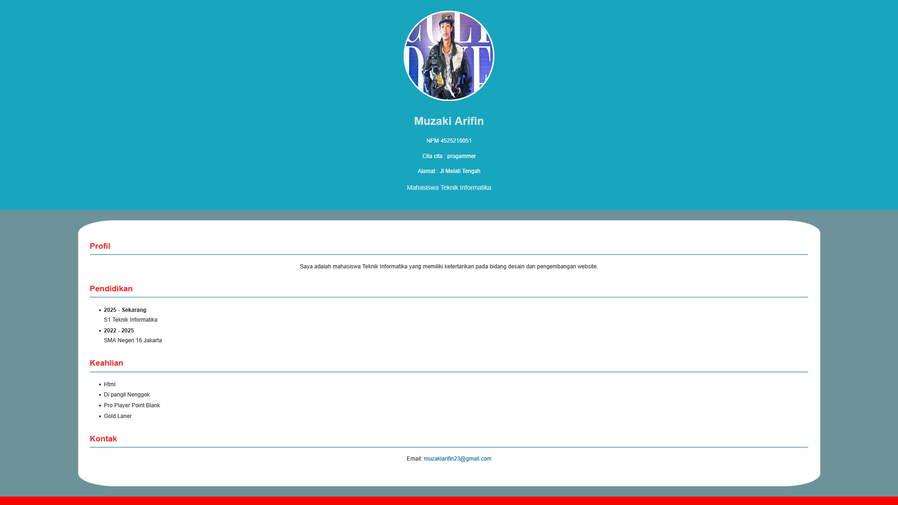

# Tugas Praktikum Pertemuan 3 - Desain Web

**Nama:** Muzaki Arifin
**NPM:** 4525210051
**Kelas:** A

## Isi Tugas

Individu

- Membuat halaman Profil Mahasiswa (Curriculum Vitae) dan menatanya dengan CSS.
- Memakai minimal 10 property CSS dan 4 format warna berbeda.
- Membuat mini style guide: font, warna utama, warna aksen, ukuran heading, dan line height.
- Readme: source code, hasil screenshot, dan ringkasan kesimpulan.

## File

| File | Keterangan |
|---|---|
| `contoh2/index.html` | Halaman Profil Mahasiswa (Curriculum Vitae) |
| `contoh2/css/style.css` | File CSS eksternal yang dihubungkan dengan `<link rel="stylesheet">` |
| `contoh2/img/bonge.jpg` | Foto profil |
| `contoh1/` | Versi awal halaman Curriculum Vitae |
| `hasil.png` | Screenshot hasil tampilan halaman |

## 10 Property CSS yang Digunakan

| No | Property | Contoh pemakaian |
|---|---|---|
| 1 | `font-family` | Arial, Helvetica, sans-serif pada `body` |
| 2 | `color` | `#333333` pada `body`, `white` pada `header` |
| 3 | `background-color` | `#6d9299` pada `body`, `#18a5be` pada `header`, `white` pada `main` |
| 4 | `font-size` | 32px (`h1`), 23px (`h2`), 16px (isi) |
| 5 | `line-height` | 1.7 pada `body`, 1.8 pada `ul` |
| 6 | `text-align` | `center` pada `header`, `p`, dan `footer` |
| 7 | `padding` | 30px pada `header` dan `main`, 15px pada `footer` |
| 8 | `margin` | `0` pada `body`, `30px auto` pada `main` untuk menengahkan konten |
| 9 | `border-radius` | 50% pada foto profil, 5% pada `main` |
| 10 | `border` | `4px solid white` pada foto profil, `4px solid rgb(248, 246, 246)` pada `main` |

Property tambahan: `width`, `height`, `font-weight`, `margin-bottom`, `border-bottom`, `padding-bottom`, `text-decoration`.

## 4 Format Warna yang Digunakan

| Format | Contoh | Dipakai untuk |
|---|---|---|
| Hex | `#18a5be` | Latar header (warna utama), `#6d9299` latar halaman, `#006699` warna tautan |
| RGB | `rgb(255, 0, 0)` | Latar footer (warna aksen), `rgb(248, 246, 246)` border `main` |
| RGBA | `rgba(245, 0, 0, 0.85)` | Judul `h2` (merah sedikit transparan), `rgba(255, 255, 255, 0.85)` teks profesi |
| Nama warna | `white` | Teks header dan footer, border foto profil |

## Mini Style Guide

**Font**

- Font utama: Arial, Helvetica, sans-serif (dipakai untuk seluruh halaman)

**Warna**

- Utama: `#18a5be` (biru toska) pada header
- Aksen: `rgb(255, 0, 0)` (merah) pada footer dan `rgba(245, 0, 0, 0.85)` pada judul `h2`
- Pendukung: `#6d9299` (latar halaman) dan `#006699` (tautan)

**Ukuran heading dan line height**

| Elemen | Ukuran | Line height |
|---|---|---|
| `h1` | 32px | 1.7 (mengikuti `body`) |
| `h2` | 23px | 1.7 (mengikuti `body`) |
| Profesi | 18px | 1.7 (mengikuti `body`) |
| Paragraf | 16px | 1.7 (mengikuti `body`) |
| Daftar (`ul`) | 16px | 1.8 |
| Footer | 14px | 1.7 (mengikuti `body`) |

## Source Code

### index.html

```html
<!DOCTYPE html>
<html lang="id">
<head>
  <meta charset="UTF-8">
  <meta name="viewport" content="width=device-width, initial-scale=1.0">
  <title>Curriculum Vitae</title>
  <!-- Menghubungkan HTML dengan file CSS -->
  <link rel="stylesheet" href="css/style.css">
</head>
<body>

  <header>
    
    <h1>Muzaki Arifin</h1>
    <p>NPM 4525210051</p>
    <p>Cita cita : progammer</p>
    <p>Alamat : Jl Melati Tengah</p>
    <p class="profesi">
    Mahasiswa Teknik Informatika
    </p>
  </header>

  <main>

    <!-- Profil -->
    <section>
      <h2>Profil</h2>
      <p>
        Saya adalah mahasiswa Teknik Informatika yang memiliki ketertarikan pada
        bidang desain dan pengembangan website.
      </p>
    </section>

    <!-- Pendidikan -->
    <section>
      <h2>Pendidikan</h2>
      <ul>
        <li>
          <strong>2025 - Sekarang</strong><br> S1 Teknik Informatika
        </li>
        <li>
          <strong>2022 - 2025</strong><br> SMA Negeri 16 Jakarta
        </li>
      </ul>
    </section>

    <!-- Keahlian -->
    <section>
      <h2>Keahlian</h2>
      <ul>
        <li>Html</li>
        <li>Di pangil Nenggok</li>
        <li>Pro Player Point Blank</li>
        <li>Gold Laner</li>
      </ul>
    </section>

    <!-- Kontak -->
    <section>
      <h2>Kontak</h2>
      <p>
        Email:
        <a href="mailto:muzakiarifin23@gmail.com"> muzakiarifin23@gmail.com
        </a>
      </p>
    </section>

  </main>

  <footer>
    <p>
      &copy; 2026 Muzaki Arifin
    </p>
  </footer>

</body>
</html>
```

### css/style.css

```css
/* =========================
   PENGATURAN DASAR HALAMAN
   ========================= */
body {
  font-family: Arial, Helvetica, sans-serif; font-size: 16px;
  line-height: 1.7; background-color: #6d9299; color: #333333;
  margin: 0;
}

/* =========================
   HEADER
   ========================= */
header {
  background-color: #18a5be; 
  color: white;
  text-align: center; 
  padding: 30px;
}

header h1 {
  font-size: 32px;
  font-weight: bold;
  color: rgba(243, 240, 240, 0.85);
  margin-bottom: 5px;
}

.profesi {
  font-size: 18px;
  font-weight: normal;
  color: rgba(255, 255, 255, 0.85);
}

.foto-profil {
  width: 250px;
  height: 250px;
  border-radius: 50%; 
  border: 4px solid white;
}

/* =========================
   KONTEN UTAMA
   ========================= */
main {
  width: 80%; margin: 30px auto;
  background-color: white;
  padding: 30px;
  border-radius: 5%; 
  border: 4px solid rgb(248, 246, 246);
}

section {
  margin-bottom: 30px;
}

h2 {
  color: #006699; 
  font-size: 23px;
  border-bottom: 2px solid #006699;
  color: rgba(245, 0, 0, 0.85); 
  padding-bottom: 5px;
}

p {
  font-size: 16px; 
  text-align: justify;
  text-align: center;
}

ul {
  line-height: 1.8;
}

/* =========================
   HYPERLINK
   ========================= */
a {
  color: #006699;
  text-decoration: none;
}

a:hover {
  text-decoration: underline;
}

/* =========================
   FOOTER
   ========================= */
footer {
  background-color: rgb(255, 0, 0);
  color: white;
  text-align: center; 
  padding: 15px;
}

footer p {
  text-align: center; font-size: 14px;
}
```

## Screenshot



## Ringkasan Kesimpulan

Pada tugas ini saya membuat halaman Profil Mahasiswa berbentuk Curriculum Vitae dan menatanya dengan file CSS eksternal yang dihubungkan lewat tag link. Saya memakai lebih dari sepuluh property CSS, di antaranya font-family, color, background-color, font-size, line-height, text-align, padding, margin, border-radius, dan border. Saya juga menggunakan empat format warna, yaitu hex, rgb, rgba, dan nama warna, sehingga saya paham bahwa satu warna bisa ditulis dengan beberapa cara dan rgba memberi kontrol tambahan berupa transparansi. Mini style guide membantu saya menjaga font, warna utama, warna aksen, ukuran heading, dan line height tetap konsisten di seluruh halaman. Dari tugas ini saya belajar bahwa CSS eksternal lebih efisien daripada CSS inline karena semua aturan tampilan dikumpulkan di satu file dan dapat dipakai ulang oleh banyak halaman, sehingga perubahan cukup dilakukan sekali. Saya juga belajar bahwa selector kelas seperti foto-profil dan profesi memudahkan pengaturan elemen tertentu tanpa memengaruhi elemen lain. Tag meta viewport juga sudah saya pasang agar halaman menyesuaikan lebar layar perangkat.
